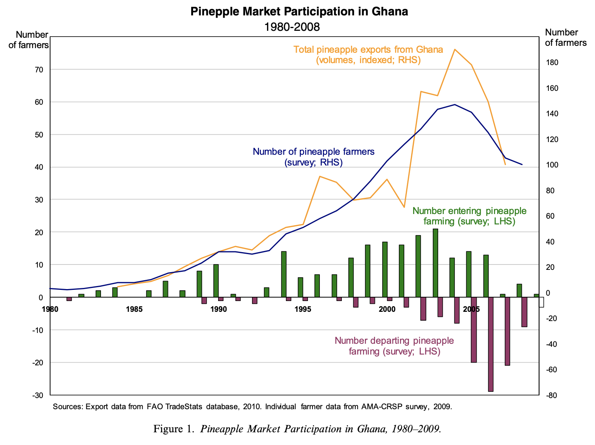

# Exercise Descriptions
Here I will describe each task and list necessary concepts, tips / tricks, and expected output.

## Importing modules to visualize data
April 29, 2020

### Background
Here we will use some very common Python 'modules' to load and plot some data, namely:
- pandas
- matplotlib.pyplot

#### Importing Modules
In a Jupyter notebook file, use Python's `import` statement to obtain the 'tools' from the module as:

`import moduleName as alias`

Where `alias` is usually just a convenient name that you would give to a module that you expect to use often, so you don't have to keep typing the long name. For example, since we'll use `matplotlib.pyplot` a couple times, let's load the module like this:

`import matplotlib.pyplot as plt`

Now, when we want to use a function that comes from the `matplotlib.pyplot` module, like `plot()` for example, we can call it quickly using the `plt.plot()` syntax.

NOTE: The common alias for `pandas` is `pd`

#### Common use of matplotlib
Here are a few of the `plt` functions that I find myself using often while creating basic data visualizations. I've linked the corresponding documentation pages on each function, since reading the documentation pages for Python modules is usually the most direct way to learn (or remember) how to use them.

[`plt.plot()`](https://matplotlib.org/3.2.1/api/_as_gen/matplotlib.pyplot.plot.html)

How exactly `plt` creates the figure and artist object is not super important to basic usage, essentially you supply the independent and dependent data variables (which need to be the same size, i.e. 5 years of time requires 5 years of data) and the function returns an image of the plot. This is where Jupyter Notebook is convenient, as the image is returned to the output right beneath your input cell. This function can take additional arguments that specify the type of marker, transparency, and/or labels, and the argument key words can found on the docs. Ones of particular interest are:

- `label='labelName'`
- `'g-'`

The second example is an argument that specifies that data points should be strung together into a line (`-`) and that it should be green (`g`). A black scatter plot would be supplied a `'k.'` and a red, dashed line plot would be supplied `'r-.'`

[`plt.figure()`](https://matplotlib.org/3.2.1/api/_as_gen/matplotlib.pyplot.figure.html)

Analogous in practice to MATLAB's `hold on` and `hold off`, this creates a new figure to house new plots that you would want on a different figure than previous plots.

`plt.legend()`

This function creates a legend for the plot figure that you are working on. Every time that you run `plt.plot()` with a label argument, the figure that the plot image lives inside stores that label along with its corresponding data. All `plt.lengend()` really does is tell the figure that it should show which labels apply to which plot markers (lines, dots, stars, etc).

`plt.xlabel()` & `plt.ylabel()` & `plt.title()`

These functions do exactly what you think, specify the axis labels and title of a given figure's plot. To include *LaTeX* type characters in these labels, just enclose the characters (e.g. greek letter or math expression) within a dollar sign like the following example:

`plt.title('Plot of the function $y = e^{i \pi x} $')` 

... gives the following title: **Plot of the function **

Notice that the arguments to these functions are text and/or LaTeX expressions interpreted as *strings*, meaning that Python sees them as text. Anything within single or double quotes will be interpreted as a string.

#### Common use of pandas

Pandas is known for its `DataFrame()` Python object, which is basically a hashtable / map object. All that means is that it stores a bunch of objects (values) by the order of their keys (ID). You can read more about [hashtables](https://www.tutorialspoint.com/python_data_structure/python_hash_table.htm) or [binary search trees](https://www.geeksforgeeks.org/binary-search-tree-data-structure/) on the respective links. 

For someone interested in basic visualization data using CSVs and Excel datafiles that are already organized to some extent, it suffices to say that `DataFrame()` objects are simply an Excel sheet containing that you don't have to look at. 

To load .xls (other Excel file extentions can be handled), you can use:

`df = pd.read_excel('filename.xls')`

You can supply an extra arugment `sheet_name=0` to load only the first sheet of the excel workbook or simply use the specified name of the excel sheet. There are corresponding methods of `pandas` for .csv and .txt (or dat files without extensions), which funcition similarly and are called `read_csv()` and `read_fwf()` respectively.

You can check to see how your new `df` looks by running `print(df)` in Jupyter or just `print(df.head)` to see the top. If you don't see all your data after printing your whole `df`, don't worry. Pandas will show the extremities of your dataset for the sake of brevity.

Now that we have the data loaded, we can do lots of stuff quickly. If by chance all your data was ordered into chronological columns and you just need to see it, plot everything against the `df` index using `df.plot()` (`pandas` is built on top of `matplotlib` so it uses its plotting functionality). I usually find it easier to *hash* out the data you want to plot from the `df` and then use `matplotlib` directly, as shown below:

If you had an Excel sheet containing a column with a title cell 'index' with increasing numbers 1, 2, 3, ... , 10 and another column 'doubled' with 2, 4, 6, ... , 10 then to extract these into a list you could write:

`index, doubled = df['index'], df['doubled']`

... giving you two lists which now contain their respective columns. Try to `print()` one of them and see how it looks.

NOTE: in Python you can assign multiple things in the same line like above and below: 

 `x, y = x_val, y_val`

At this point, you can plot these lists (which should be equally sized if the raw data was correctly organized) directly with `matplotlib`:

`plt.plot(index, doubled)`

### Tasks
#### SETUP
First, get the datafile by running the following command from a folder that you'd like to work from:

`wget https://raw.githubusercontent.com/zzstoatzz/birdo/master/L1/GhanaPineapples.xls`

This is a small dataset related to pineapple farming in Ghana, used in a Hope Michelson publication that investigate the farming, wide-scale production, and participants of the pineapple market in Ghana:

<p align="center"></p>

Then create a new .ipynb notebook file in that directory and import the modules as directed in the Background.

**protip:** create a cell at the top of your notebook and copy in these commands for high resolution and wide working space:

```
from IPython.core.display import display, HTML
display(HTML("<style>.container { width:100% !important; }</style>"))
import matplotlib as mpl
mpl.rcParams['figure.dpi']= 300
mpl.rcParams['font.family']= 'serif'
```

Remember that once you've loaded your data you can use `print(df.head)` to look at the *key* names of the columns, but to avoid having to type keynames, you can unpack the list of column names with easy-to-type string variables (make your variable names representative):

`c1, c2, c3 = df.columns`

where the datafile had 3 columns. When hashing/extracting data from the `df`, use these variables as an alias for the clunky column names on the actual datafile (e.g. 'Production (tonnes)')

#### TASKS

#### Task 1: Extract and Plot 
Show the time evolution of pineapple **production** in Ghana across the timescale of years provided. Title & label axes appropriately and include a legend.

#### Task 2: Manipulate Extracted Data
Use `plt.bar()`, which works basically the same way as `plt.plot()` to create a bar chart showing the annual pineapple yield, i.e. the **Production** per **Area Harvested** across the timescale. Title, label and add a legend to your plot as before.

**HINT:** if `x = [4, 6, 8]` and `y = [2, 3, 4]` then `z = x/y` returns `z = [2, 2, 2]`

#### Task 3: Conditionally Manipulate Extracted Data using loops
Look up how to use  `df.iterrows()` and create new list outside the `df` representing only the verified **production** datapoints and interpolate the 'flagged' datapoints using the previous and following years. That is:

```
if row[flag] == '':
    do nothing
else:
    row[flag] = interpolated value
```
Since you'll be iterating through the `df`, you'll want a copy of the production values list that isn't being changed. Use the `i` iterator value to index your copy of the list that's stored outside the `for` loop and get the years before and after any given year like:

 `P_copy[i-1] = PrevYearsValue`

 AND

 `P_copy[i+1] = NextYearsValue` 


Plot the production trend on top of the trend from **Task 1** as a dashed line plot, changing the **Task 1** datapoints to scatter plot. Include titles, labels, and legends as before.

#### Task 4. Post for Yoshi Inspection
Create a GitHub account, create a repo for this and upcoming excersies (maybe call it 'learnPython') and the follow the directions to either manually upload your .ipynb notebook or to `push` the file from your terminal.
