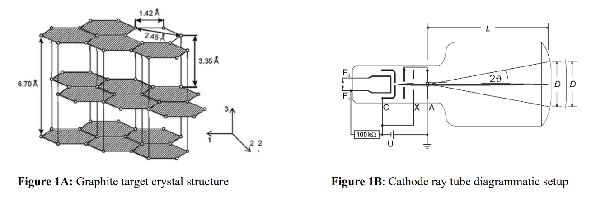
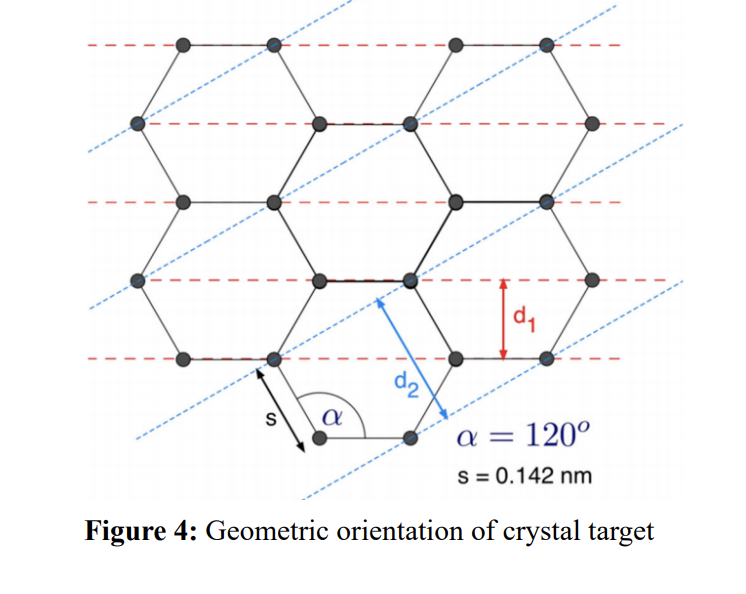
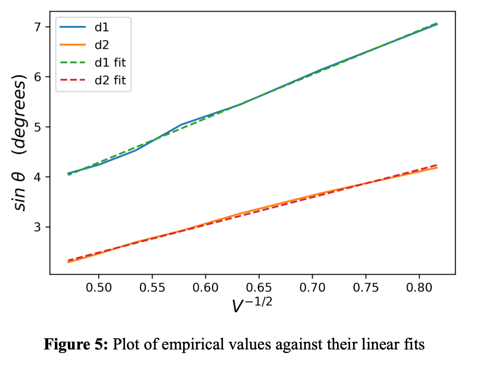
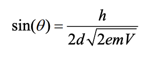

# Exercise Descriptions
Here I will describe each task and list necessary concepts, tips / tricks, and expected output.

Exercise Quicklinks:
- [Exercise 1](#-Exercise-1)
- [Exercise 2](#-Exercise-2)
<hr>
<hr>

# Exercise 1
## Importing modules and basic pandas / matplotlib
April 29, 2020
<hr>

### Background


#### Importing Modules
In a Jupyter notebook file, use Python's `import` statement to obtain the 'tools' from the module as:

`import moduleName as alias`

Where `alias` is usually just a convenient name that you would give to a module that you expect to use often, so you don't have to keep typing the long name. For example, since we'll use `matplotlib.pyplot` a couple times, let's load the module like this:

`import matplotlib.pyplot as plt`

Now, when we want to use a function that comes from the `matplotlib.pyplot` module, like `plot()` for example, we can call it quickly using the `plt.plot()` syntax.

NOTE: The common alias for `pandas` is `pd`
<hr>

#### Common use of matplotlib
Here are a few of the `plt` functions that I find myself using often while creating basic data visualizations. I've linked the corresponding documentation pages on each function, since reading the documentation pages for Python modules is usually the most direct way to learn (or remember) how to use them.

[`plt.plot()`](https://matplotlib.org/3.2.1/api/_as_gen/matplotlib.pyplot.plot.html)

How exactly `plt` creates the figure and artist object is not super important to basic usage, essentially you supply the independent and dependent data variables (which need to be the same size, i.e. 5 years of time requires 5 years of data) and the function returns an image of the plot. This is where Jupyter Notebook is convenient, as the image is returned to the output right beneath your input cell. This function can take additional arguments that specify the type of marker, transparency, and/or labels, and the argument key words can found on the docs. Ones of particular interest are:

- `label='labelName'`
- `'g-'`

The second example is an argument that specifies that data points should be strung together into a line (`-`) and that it should be green (`g`). A black scatter plot would be supplied a `'k.'` and a red, dashed line plot would be supplied `'r-.'`

[`plt.figure()`](https://matplotlib.org/3.2.1/api/_as_gen/matplotlib.pyplot.figure.html)

Analogous in practice to MATLAB's `hold on` and `hold off`, this creates a new figure to house new plots that you would want on a different figure than previous plots.

`plt.legend()`

This function creates a legend for the plot figure that you are working on. Every time that you run `plt.plot()` with a label argument, the figure that the plot image lives inside stores that label along with its corresponding data. All `plt.lengend()` really does is tell the figure that it should show which labels apply to which plot markers (lines, dots, stars, etc).

`plt.xlabel()` & `plt.ylabel()` & `plt.title()`

These functions do exactly what you think, specify the axis labels and title of a given figure's plot. To include *LaTeX* type characters in these labels, just enclose the characters (e.g. greek letter or math expression) within a dollar sign like the following example:

`plt.title('Plot of the function $y = e^{i \pi x} $')` 

... gives the following title: **Plot of the function **

Notice that the arguments to these functions are text and/or LaTeX expressions interpreted as *strings*, meaning that Python sees them as text. Anything within single or double quotes will be interpreted as a string.
<hr>

#### Common use of pandas

Pandas is known for its `DataFrame()` Python object, which is basically a hashtable / map object. All that means is that it stores a bunch of objects (values) by the order of their keys (ID). You can read more about [hashtables](https://www.tutorialspoint.com/python_data_structure/python_hash_table.htm) or [binary search trees](https://www.geeksforgeeks.org/binary-search-tree-data-structure/) on the respective links. 

For someone interested in basic visualization data using CSVs and Excel datafiles that are already organized to some extent, it suffices to say that `DataFrame()` objects are simply an Excel sheet containing that you don't have to look at. 

To load .xls (other Excel file extentions can be handled), you can use:

`df = pd.read_excel('filename.xls')`

You can supply an extra arugment `sheet_name=0` to load only the first sheet of the excel workbook or simply use the specified name of the excel sheet. There are corresponding methods of `pandas` for .csv and .txt (or dat files without extensions), which funcition similarly and are called `read_csv()` and `read_fwf()` respectively.

You can check to see how your new `df` looks by running `print(df)` in Jupyter or just `print(df.head)` to see the top. If you don't see all your data after printing your whole `df`, don't worry. Pandas will show the extremities of your dataset for the sake of brevity.

Now that we have the data loaded, we can do lots of stuff quickly. If by chance all your data was ordered into chronological columns and you just need to see it, plot everything against the `df` index using `df.plot()` (`pandas` is built on top of `matplotlib` so it uses its plotting functionality). I usually find it easier to *hash* out the data you want to plot from the `df` and then use `matplotlib` directly, as shown below:

If you had an Excel sheet containing a column with a title cell 'index' with increasing numbers 1, 2, 3, ... , 10 and another column 'doubled' with 2, 4, 6, ... , 10 then to extract these into a list you could write:

`index, doubled = df['index'], df['doubled']`

... giving you two lists which now contain their respective columns. Try to `print()` one of them and see how it looks.

NOTE: in Python you can assign multiple things in the same line like above and below: 

 `x, y = x_val, y_val`

At this point, you can plot these lists (which should be equally sized if the raw data was correctly organized) directly with `matplotlib`:

`plt.plot(index, doubled)`
<hr>

### Tasks
#### SETUP
First, get the datafile by running the following command from a folder that you'd like to work from:

`wget https://raw.githubusercontent.com/zzstoatzz/birdo/master/L1/GhanaPineapples.xls`

This is a small dataset related to pineapple farming in Ghana, used in a Hope Michelson publication that investigate the farming, wide-scale production, and participants of the pineapple market in Ghana:

<p align="center"></p>

Then create a new .ipynb notebook file in that directory and import the modules as directed in the Background.

**protip:** create a cell at the top of your notebook and copy in these commands for high resolution and wide working space:

```
from IPython.core.display import display, HTML
display(HTML("<style>.container { width:100% !important; }</style>"))
import matplotlib as mpl
mpl.rcParams['figure.dpi']= 300
mpl.rcParams['font.family']= 'serif'
```

Remember that once you've loaded your data you can use `print(df.head)` to look at the *key* names of the columns, but to avoid having to type keynames, you can unpack the list of column names with easy-to-type string variables (make your variable names representative):

`c1, c2, c3 = df.columns`

where the datafile had 3 columns. When hashing/extracting data from the `df`, use these variables as an alias for the clunky column names on the actual datafile (e.g. `prod` for 'Production (tonnes)').
<hr>

#### TASKS

#### Task 1: Extract and Plot 
Show the time evolution of pineapple **production** in Ghana across the timescale of years provided. For readability, you can label the y-axis in thousands of tonnes rather than tonnes (700,000 to 70k). Title & label axes appropriately and include a legend.
<hr>

#### Task 2: Manipulate Extracted Data
Use `plt.bar()`, which works basically the same way as `plt.plot()` to create a bar chart showing the annual pineapple yield, i.e. the **Production** per **Area Harvested** across the timescale. Title, label and add a legend to your plot as before.

**HINT:** if `x = [4, 6, 8]` and `y = [2, 3, 4]` then `z = x/y` returns `z = [2, 2, 2]`
<hr>

#### Task 3: Conditionally Manipulate Extracted Data using loops
Look up how to use  `df.iterrows()` and create new list outside the `df` representing only the verified **production** datapoints and interpolate the 'flagged' datapoints using the previous and following years. That is:

```
if row[flag] == '':
    do nothing
else:
    P_copy[i] = interpolated value from nearby rows
```
Since you'll be iterating through the `df`, you'll want a copy of the production values list that isn't being changed. Use the `i` iterator value to index your copy of the list that's stored outside the `for` loop and get the years before and after any given year like:

 `P_copy[i-1] = PrevYearsValue`

 AND

 `P_copy[i+1] = NextYearsValue` 


Plot the production trend on top of the trend from **Task 1** as a dashed line plot, changing the **Task 1** datapoints to scatter plot. Include titles, labels, and legends as before.
<hr>

#### Task 4: Post for Yoshi Inspection
Create a GitHub account, create a repo for this and upcoming excersies (maybe call it 'learnPython') and the follow the directions to either manually upload your .ipynb notebook or to `push` the file from your terminal.
<hr>
<hr>

# Exercise 2
## Crystal diffraction as a vehicle for learning `pandas` & `list` comprehension 

### Background

#### Creating and importing custom modules
Oftentimes, writing all the code you need for some purpose in the same file is cumbersome. It helps to organize functions/classes/definitions of the same conceptual purpose in the same file, which you could refer to as a module (or packages). This is generally what people mean when they say *modular* code. 

In Exercise 1, you used `pandas` and `matplotlib`, both of which are someone else's custom modules. You imported them (collected their tools) by including a line similar to...
```python
import matplotlib.pyplot as plt 
```

There's some file somewhere on your computer (included in the Anaconda distribution) that contains all `plt` function definitions so that when you type `plt.plot()`, you're actually referencing your own local version of that function. 

If you have a specific set of goals that require something beyond the capabilities of modules you're aware of, you should **first** google more extensively and **then** consider making your own custom module. That said, I would bet a lot of money that most non-trivial academic endeavors that use numerical methods, utilize some kind of custom module (package, header file, etc). That's why I think its important to focus on, also considering *modular* program design is relevant outside of any given programming language. The module you write will be your own little black magic box that you can create once and then call functions from it in the future, whenever applicable. 

You can (and should!) use common, public (`plt`, `np`, etc) modules in your custom modules, there's no rule to the contrary. Doing so helps in creating readable, modular code and prevents you from recreating the wheel. Here's what I mean, imagine the below is a hypothetical module (python file) called `helpers.py`:

```python
import matplotlib.pyplot as plt
import numpy as np

# function 'doStuff' definition, takes inputs = [N, A, B] as an argument
def doStuff(inputs):

    # N = integer num datapoints, A, B are lists of length N
    N, A, B = inputs  

    # create normalized domain of length N
    x = np.linspace(0, 1, N)

    # can reference plt functions, since you imported at the top 
    plt.plot(x, A)
    plt.plot(x, B)

```
**NOTE** :   &nbsp;`N, A, B = inputs` &nbsp; is just the unpacking of a list, as in `c1, c2, c3 = df.columns` from Exercise 1. I do this to avoid having a lot of function arguments.

Now, if you have such a file created, you can import your module to somewhere else (like a Jupyter Notebook!) using the syntax shown below (top example) and call it like `h.doStuff()` (providing the argument `inputs` of course). Alternatively, use the bottom example to import all (i.e. `*`) functions from your module. This way, you don't need an alias (like `h`) and can just call your functions by using their name, e.g. `doStuff()`. This second method is perfectly fine, just be careful to avoid duplicating function names.

```python 
import helpers as h
## or 
from helpers import *
```
<hr>

#### Pythonic list comprehension 
Python lists are super useful for learning, since they can contain any type and are mutable (can be altered). If you wanted to make some lists and you didn't know about list comprehension, you might do something like:

```python
# adding each element of a list one at a time
### (assume you have defined a list of elements called 'elements') ###
list = []
list.append(elements[0])                # add 0th element
list.append(elements[1])                # add 1st element
list.append(elements[2])                # add 2nd element
...                                     # add elements 3 thru N-2
list.append(elements[len(elements)-1])  # add last element
# yielding: list = [element0, element1, ... , elementLast]


# or if you know about FOR loops
list2 = []
for element in elements:
    list2.append(element) 
# yielding: list2 = [element0, element1, ... , elementLast]


# you want a list for a dependent variable of the form y = coef*x?
### (assume you've defined a coefficient 'coef') ###
list3 = []
for element in elements:
    newElement = coef*element
    list3.append(newElement)
# yielding: list3 = [newElement0, newElement1, ... , newElementLast]
```

In most cases, it's quicker and more readable if you use list comprehension. The syntax goes:

```python
# basic list comprehension
list = [f(i) for i in somethingIterable]

# conditional list comprehension
pickyList = [f(i) for i in somethingIterable if condition else altValue]
```

Where `f(i)` can be literally anything, and `altValue` is the value added to the list if `condition` is false. Here are the same three examples as above, this time using list comprehension:

```python
# again, assume you have defined a list of elements called 'elements'
list = [element for element in elements]
# yielding: list = [element0, element1, ... , elementLast]
# This example does the same thing as the first two examples above!


# list for a dependent variable of the form y = coef*x 
### (again assume you've defined a coefficient 'coef') ###
list3 = [coef*element for element in elements]
# yielding: list = [coef*element0, coef*element1, ... , coef*elementLast]
```
Like I said, `f(i)` can be pretty much anything, whether it involves the iterator `i` or not. It can be a huge complicated function, class instantiation, ... so list comprehensions are really helpful (and clean). I can assure you that it will be helpful to use them as you do the tasks below.

However, don't over-complicate things. Remember that if you just want two lists of the same length (as you would in plotting `y = 2*x`), then if you had `x = [0, 1, 2]` then `y = 2*x` gives you `y = [0, 2, 4]` without a list comprehension.
<hr>

#### Relevance of diffraction in study of soot formation

The wave-like properties of electrons have been used study molecular crystal structure for over 100 years, by those who knew of particle-wave duality, and those who didn't. Often a cathode ray tube (CRT) is used to produce a diffraction pattern as it shoots electrons into a crystalline target. These electrons hit at different points in the crystal lattice, and some are reflected towards the observation screen. One can study the [diffraction patterns](https://en.wikipedia.org/wiki/Diffraction) that result from reflected electrons hitting the screen to figure out properties of the crystalline material. 

<p align="center"></p>

Here, we will look at graphite since it is has a relatively simple crystal structure. This method of shooting electrons out of a CRT is applied widely in characterizing materials ([like soot](http://nznano.blogspot.com/2017/10/)) at the molecular scale.
<hr>

#### Hypothetical Experimental Setup and Relevant Equations
Define constants in Jupyter so you can use them as inputs to your helper functions. 

Assume that *L* from the diagram above is 135 millimeters.

<p align="center"></p>

Using geometry, try to figure out what the actual value of the ratio `d2/d1` should be theoretically. Hover your mouse over <span title="ratio_theo = (np.tan(alpha/4)+1/np.sin(alpha/2))
">THIS TEXT</span> to check your answer.


##### Functions you'll find helpful
```python 
# V is the incremented voltage, which is also tabulated in data.csv
def invSqrtV(V):
    return 1/(np.sqrt(V))

# D is the observed diameter at a given voltage, which is tabulated in data.csv
def sinTheta(D, L):             # can be D1 or D2, works for both
	t = 1/2*(np.arctan(D/2/L))  # this the 'Bragg Angle'
	return np.sin(t)            # gives radians, not degrees
```

##### Physical constants you will use
```python 
    h = 6.626070040e-34  # Planck's constant - J*s
    e = 1.6021766208e-19 # charge of electron - C
    m_e = 9.10938356e-31 # mass of electron - kg
```
<hr>

### Tasks
#### SETUP

Reuse the **protip** from Exercise 1 for a wide, high-resolution display in Jupyter.

Follow [this link](https://code.visualstudio.com/Download) and download the MacOS version of VS Code. You can then open it as you would any other application.

**pro-tip**: Right click the 'Explorer' pane of VS code to open a directory.

<hr>

#### Task 1: Create helper module
Create a file in VS code called `helpers.py`,  where the functions you create will live. Create the file in the same directory as your Jupyter notebook. **Don't worry about actually writing the functions yet.** Outline it something like this:
```python 
# import as needed while writing the functions
# these are what I might use, but use what makes sense to you
import numpy as np
import matplotlib.pyplot as plt

def deriveFromData(args):
    # write code here that should be run when you call 'deriveFromData()'

def calcD1(args):
    # write code here that calculates d1

def calcD2(args):
    # write code here that calculates d2
```

Import your module into your Jupyter Notebook to make sure you don't have any errors. You'll have to restart your notebook kernel (with the button in the menu bar) for changes in your module file to take effect in your notebook. If you get an error, google the last line of the error and you'll find a relevant StackOverflow post right away.

**pro-tip:** Create a new keyboard shortcut for restarting the kernel (I like **Ctrl + `** i.e. control and backquote, for ergonomic reasons) since you'll often want to see how changes to your module effect your output in Jupyter.

<hr>

#### Task 2: Successfully import data.csv into a pandas `df`
Just like in Exercise 1, import `'data.csv'` into a dataframe (`df`) that you can easily manipulate. Print it from Jupyter to make sure you did it right. 

**HINT**: What lists would be convenient to extract from the `df` for further manipulation? Look at [this part of Exercise 1](####-Common-use-of-pandas) for a refresher on extracting lists from `df` objects.

<hr>

#### Task 3: Implement a function to derive quantities from raw data
In order to find the lattice diameters, you need the sine of the diffraction angle across the scaled range of voltages (as described in Background). Write a function that calculates these values and `return` them to Jupyter.

**NOTE**: you can `return` multiple things in python, e.g &nbsp; `return sin_theta, inv_sqrtV`

If you want to check your calculations so far, use `plt` to plot your angle lists against your voltage lists, you should see something like:

<p align="center"></p>


<hr>

#### Task 4: Write a function to print the ratio `d2/d1`
Write a function that takes in the lists of derived quantities, fits them using [`np.polyfit()`](https://numpy.org/doc/1.18/reference/generated/numpy.polyfit.html) and use the slope relation below to back out each diameter *d* (note that *m* below is `m_e` as defined in **Background** ). Then you can easily `print(D2/D1)` from within your helper function. 

<p align="center"></p>


**NOTE**: It might be confusing to use `print()` in a file that isn't the place you want to see your output, but just remember that Jupyter is just referencing your module, your code is not running in your text editor.
<hr>

#### Task 5: Push to GitHub for Yoshi Inspection
Push your Jupyter notebook and helper module to your existing birdo repo from the command line or by going to the web app.
<hr>

### Conclusion
I felt that this was birdo exercise was a good intersection of: concepts involved in soot characterization, basic relational databasing, and the modularization of programs (in a Pythonic way, at least). I hope you like it.